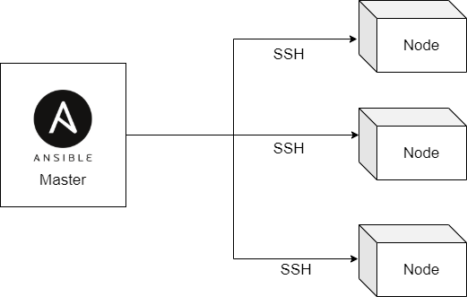

<p align="center">
    
</p>

# 1. Ansible Intro


- Open source.
- Simple.
- Agentless.
- Automation.
- Powerful.
- YAML.

https://www.ansible.com/


# 2. Basics

## 2.1 Installation
Installing Ansible on a specific OS

https://docs.ansible.com/ansible/latest/installation_guide/installation_distros.html

## 2.2 ansible.cfg
This is a configuration file which stores some Ansible settings.

The order for Ansible to get this file:

1. ANSIBLE_CONFIG (Your environmental variable).

2. ansible.cfg (The current directory).

3. ~/.ansible.cfg (The home directory of the current user).

4. /etc/ansible/ansible.cfg.

An Example:
```
[defaults]
host_key_checking = False
inventory = hosts
command_warnings = False
deprecation_warnings = False
interpreter_python = /usr/bin/python3
```

https://docs.ansible.com/ansible/latest/reference_appendices/config.html

## 2.3 Inventory
Information of target systems is stored in an inventory file.

If you don't create your own inventory file, ansible create its default one at `/etc/ansible/hosts`.

An example:
```
DevOpsBootcampDev ansible_host=34.224.86.9
DevOpsBootcampProd ansible_host=54.152.168.200
DevOpsBootcampTest ansible_host=54.147.178.172

[DevOpsBootcamp-servers]
DevOpsBootcampDev
DevOpsBootcampProd
DevOpsBootcampTest

[DevOpsBootcamp-servers:vars]
ansible_user=ec2-user
ansible_ssh_private_key_file=~/.ssh/id_rsa
```
`ansible -i hosts all -m ping` - Test whether you are able to connect to your target nodes.
```
DevOpsBootcampTest | SUCCESS => {
    "changed": false,
    "ping": "pong"
}
DevOpsBootcampDev | SUCCESS => {
    "changed": false,
    "ping": "pong"
}
DevOpsBootcampProd | SUCCESS => {
    "changed": false,
    "ping": "pong"
}
```
## 2.4 Ad hoc commands
Ad hoc commands are great for tasks you repeat rarely.

`ansible [pattern] -m [module] -a "[module options]"`

### 2.4.1 Pattern: targeting hosts and groups
You can use patterns to refer which managed node or groups you wanted to run commands against.

For example:
```
ansible DevOpsBootcamp-servers -a "df -h"
ansible DevOpsBootcamp-servers -a "free -m"
ansible DevOpsBootcamp-servers -a "date"
ansible DevOpsBootcamp-servers -a "docker ps"
```

### 2.4.2 Modules
Modules, also called as task plugins or library plugins, are discrete units of code that Ansible uses in the command line or the playbooks.

For example: *command*, *script*, *yum* and *service*

`ansible DevOpsBootcamp-servers -b -m reboot` - Reboot the nodes.

`ansible DevOpsBootcamp-servers -m command -a "name=httpd state=restarted"` - Restart the httpd service.

`ansible DevOpsBootcamp-servers -m yum -a "name=docker state=present"` - Install Docker.

`-a` stands for module arguments.

The list of all modules and their documentation can be found here: https://docs.ansible.com/ansible/latest/collections/index_module.html

## 2.5 Playbook
The playbook is written in YAML format.

It is a set of instructions for Ansible to work on.

Basically it is a ordered list of Ansible Ad hoc commands in YAML format.

`ansible-playbook -i <inventory> <playbook_name>` - To execute a playbook.

### 2.5.1 Play
Play is a set of tasks to be run on the target nodes.

It consists of *name*, *host* and *tasks*

```yaml
- name: Install Docker
  hosts: DevOpsBootcamp-servers
  # execute the tasks as a root user
  become: yes
  tasks:
    - name: install Docker
      yum:
        name: docker
        update_cache: yes
        state: present
```

### 2.5.2 Tasks
Tasks consist of a list of actions to be executed on the target nodes.

It has *name*,  *module* and the modules' arguments.

It is a list so the order of tasks matters.


# 3. This Workshop
We are going to use Ansible to execute the following tasks agains the target nodes:
- Install Docker.
- Add the ec2-user to the Docker group.
- Pull my webpage Docker image.
- Run a container of that image.
- Check the status of the containers.

The first step is to navigate to the Terraform ec2 workshop directory and run `terraform init` to initialize the project.

Then execute `terraform apply --auto-approve` to provision 3 ec2 instances in a new VPC.(Modify the location of your AWS credential accorddingly). This step will also generate a hosts file in the Ansible lab directory.

Next, navigate to the Ansible lab directory and run `ansible-playbook -i hosts my-playbook` to deploy the webpage on the target hosts.