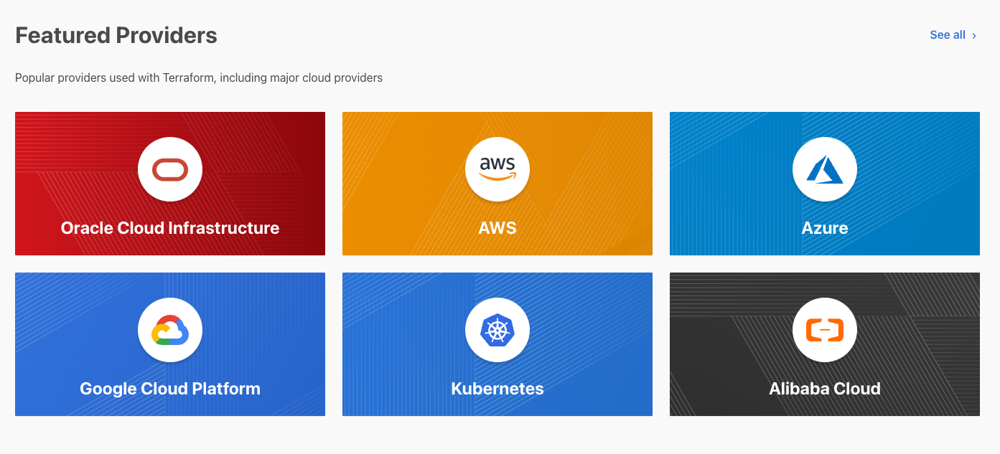
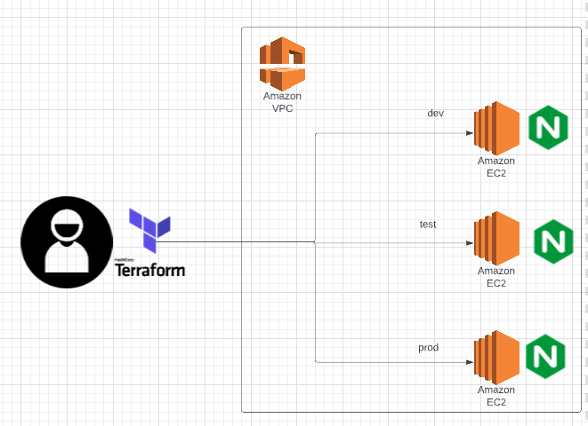

<p align="center">
    
</p>

# 1. Terraform Intro


- Terraform is a free, open source tool which is used to configure and manage infrasturcture on clouds and other resources.
- The configuration files are written in HCL (HarshiCorp Configuration Language).
- Easy to Install.
# 2. Basics
## 2.1 Provider
- Providers are basically APIs of all kinds of resources, such as AWS, Azure, GCP etc.
- Terraform make uses of providers to create or destroy resources on clouds.

### Example Usage
```HCL
terraform {
  required_providers {
    aws = {
      source  = "hashicorp/aws"
      version = "~> 4.0"
    }
  }
}
# Configure the AWS Provider
provider "aws" {
  region = "us-east-1"
}
```
## 2.2 Resource
The `resource` is a block name. Then you can specify which resource type you are going to use and give it a name. In the following example, the provider is `aws`, the resource type is `aws_vpc` and the resource name is `example`.

Each resource type has specific arguments that they expect.
### Example Usage
```HCL
# Create a VPC
resource "aws_vpc" "example" {
  cidr_block = "10.0.0.0/16"
}
```
## 2.3 Data Source
It allows terraform to read attributes from resources which are not created by terraform.
```HCL
# get the image you expected
data "aws_ami" "latest-amazon-linux-image"{
    most_recent = true
    owners = ["amazon"]
    filter {
        name = "name"
        values = [var.image_name]
    }
    filter {
        name = "virtualization-type"
        values = ["hvm"]
    }
}
```
## 2.4 Variables
Variables can be declared in the configuraiton file. The types of variables can be:
- string
- number
- bool
- any
- list
- map
- object
- tuple
```HCL
variable env_prefix {
    type = string
    default = "DevOpsBootcamp"
}
```

## 2.5 Output
It prints the value of an attribute on the prompt when the tasks complete.
``` HCL
output "ec2_public_ips" {
    value = {
        for key, server in aws_instance.DevOpsBootcamp-server :  key => server.public_ip
    }
}
```
## 2.6 State file
The *terraform.tfstate* file is created after executing `terraform apply`. The content of it corresponds with the real world infrastructure resources.

It is very sensitive, so don't push it to the github public repository.
# 3 Terraform commands

`apt-get install terraform` - Installing on Linux.

**useful commands**

`terraform fmt` - Lint your configuration files, make it look nice.

`terraform validate` - Validate your template, check whether all providers in the configuration files are installed and check whether there are syntax errors.

`terraform show` - Show you what's in the terraform.tfstate file.


**Initialization**

`terraform init`

**Preview terraform actions**

```sh
terraform validate
terraform plan
```
`terraform plan -out=<file address>` - Save the plan.

`terraform apply -input=<plan file>` - Use the plan file as input to create infrastructure.

**Apply configuration with variables**

```sh
terraform apply -var-file terraform-dev.tfvars
terraform apply --auto-approve
```

**Destroy a single resource**

`terraform destroy -target aws_vpc.myapp-vpc`

**Destroy everything from tf files**

`terraform destroy`

**Show resources and components from current state**

`terraform state list`

**Show current state of a specific resource/data**

`terraform state show <resource name>`

# 4. This workshop
Create a terraform configuration which can:
- Create a AWS VPC, including 1 subnet, 1 route table, 1 internet gateway and 1 security group.
- Create 3 identical EC2 instances and name them:
    - "DevOpsBootcampDev".
    - "DevOpsBootcampProd".
    - "DevOpsBootcampTest".
- Install Nginx on each of them.

